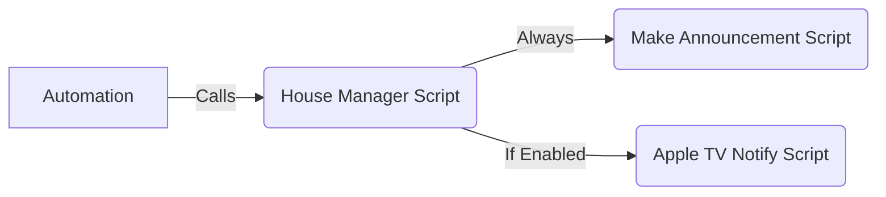

# 🏠 House Notification Manager (Script Blueprint)


The centralized **"Conductor"** for all home audio announcements.

Instead of adding complex logic to every single automation, you can call this single manager script. It intelligently routes your text-to-speech (TTS) message to the correct sub-systems (Standard Speakers vs. Apple TVs) based on your preferences for that specific event.

## 🔗 The Architecture
This blueprint does not handle the announcement logic itself. It orchestrates **other scripts** to do the work, acting as a simple routing hub.



> [!IMPORTANT]
> **Prerequisites: Worker Scripts**
> This blueprint will not work unless you have already imported and configured the following two blueprints. This manager script calls them to perform the actual announcements.
> 1. **`notify_media_players.yaml`** (handles standard speakers)
> 2. **`notify_apple_tvs.yaml`** (handles Apple TV notifications)

---

## ⚙️ Configuration (Blueprint Inputs)
When importing this blueprint, you must "wire it up" to your hardware groups and the worker scripts you created above.

| Input | Description | Example |
| :--- | :--- | :--- |
| **Standard Speaker Group** | The entity group for your permanent speakers (Echo Dots, etc.).| `media_player.all_speakers` |
| **Apple TV Group** | The entity group containing all your Apple TVs. | `media_player.all_apple_tvs` |
| **Script: Make Announcement** | Select the entity ID of your script from `notify_media_players.yaml`.| `script.make_announcement` |
| **Script: Notify Apple TVs**| Select the entity ID of your script from `notify_apple_tvs.yaml`.| `script.apple_tv_notify` |

---

## 📝 Usage (Runtime Fields)
When calling this script from an automation, you can use the following fields.

| Field | Description | Default |
| :--- | :--- | :--- |
| **`message_text`** | The text you want spoken. | *(Required)* |
| **`notify_apple_tvs`**| If `true`, the message is sent to Apple TVs. If `false`, they are skipped. | `true` |

---

## 💡 YAML Examples

### Example 1: Announce Everywhere
The dishwasher is done. You want the whole house to know, including anyone watching TV.

```yaml
action:
  - service: script.house_notification_manager
    data:
      message_text: "The Dishwasher cycle is complete."
      notify_apple_tvs: true
```

### Example 2: Announce Quietly
It's late at night. You want a subtle announcement on the smart speakers but don't want to interrupt a movie on the Apple TV.

```yaml
action:
  - service: script.house_notification_manager
    data:
      message_text: "The garage door has been left open."
      notify_apple_tvs: false
```
