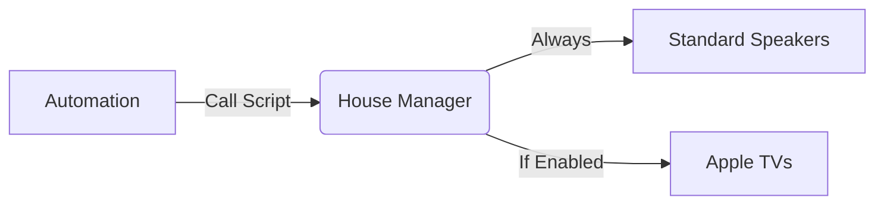

# 🏠 House Notification Manager (Script Blueprint)


The centralized "Conductor" for all home audio announcements.

Instead of adding complex logic to every single automation in your house, you call this single manager script. It intelligently routes your text-to-speech (TTS) message to the correct sub-systems (Standard Speakers vs. Apple TVs) based on your preferences.

Configuration (One-Time Setup)
Because this script acts as a manager, you must "wire it up" to your existing hardware groups and worker scripts during the Blueprint Import process.


## 🔗 The Architecture

This blueprint does not speak directly. It orchestrates **other scripts** to do the work:

1. **Standard Speakers:** Calls the **"Make Announcement"** script (always fires).
2. **Apple TVs:** Calls the **"Apple TV Notify"** script (conditional).



⚙️ Configuration (One-Time Setup)
Because this script acts as a manager, you must "wire it up" to your existing hardware groups and worker scripts during the Blueprint Import process.

| Input	|Description |
| :--- | :--- |
| Standard Speaker Group	| The entity group for your permanent speakers (Sonos, Echo Dots, Google Home). |
| Apple TV Group	|The entity group containing all your Apple TVs. |
| Script: Make Announcement	| Select the entity ID of your imported "Make Announcement" script. |
| Script: Notify Apple TVs	| Select the entity ID of your imported "Apple TV Notify" script. |
<br>

Prerequisites You must have the "Media Player Control" and "Apple TV Notify" blueprints imported and instantiated as scripts before setting up this manager.

---

📝 Usage (Automation)
When calling this script in an automation, you can use the following fields:

🔹 Fields

Message Text (Required): The text you want spoken.

Notify Apple TVs (Optional): A boolean (True/False).

true (Default): Attempts to broadcast to Apple TVs (subject to their internal "Smart Filtering" logic).

false: Skips Apple TVs entirely (Standard speakers only).

---


💡 YAML Example
Scenario: The dishwasher has finished. You want the whole house to know, including Apple TV viewers.

```YAML
action: script.house_notification_manager
data:
  message_text: "The Dishwasher cycle is complete."
  notify_apple_tvs: true
```

Scenario: It is late at night. You want a subtle announcement on the Echo Dots, but you don't want to interrupt the movie playing on the Apple TV.

```YAML
action: script.house_notification_manager
data:
  message_text: "Garage door is still open."
  notify_apple_tvs: false
```
